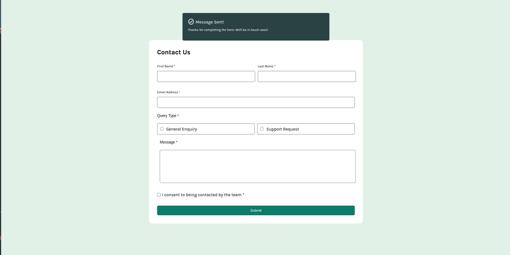

# Formulário de Contato

Este projeto consiste em uma página web contendo um formulário de contato. O formulário possui campos para o nome, sobrenome, e-mail, tipo de consulta, uma área de mensagem e um checkbox de consentimento. A validação do formulário é feita com JavaScript, enquanto o design e os estilos da página são aplicados com HTML e CSS.

### Este projeto foi feito como parte de um desafio do **Frontend Mentor**.

O objetivo do desafio foi criar uma página web funcional e com design responsivo utilizando apenas HTML, CSS e JavaScript.

## Funcionalidades

O formulário contém os seguintes campos:

- **Nome**: Campo de texto para o nome do usuário.
- **Sobrenome**: Campo de texto para o sobrenome do usuário.
- **E-mail**: Campo para inserir o e-mail do usuário, com validação para garantir que o formato do e-mail seja correto.
- **Tipo de Consulta**: Um conjunto de botões de rádio para o usuário escolher o tipo de consulta que deseja fazer.
- **Mensagem**: Um campo de área de texto onde o usuário pode escrever sua mensagem.
- **Checkbox**: Um campo de checkbox que o usuário deve marcar para consentir com os termos antes de enviar o formulário.

### Tecnologias Utilizadas

- **HTML**: Estrutura básica da página e do formulário.
- **CSS**: Estilização da página e do formulário para um design mais agradável.
- **JavaScript**: Validação do formulário para garantir que todos os campos sejam preenchidos corretamente antes do envio.

## Validação

A validação do formulário é realizada com JavaScript, garantindo que:

- O nome e o sobrenome sejam preenchidos.
- O e-mail tenha o formato correto.
- O tipo de consulta seja selecionado.
- A mensagem não seja vazia.
- O checkbox seja marcado para consentir com os termos.

## Captura da Página

Aqui está uma captura de tela da página com o formulário:

